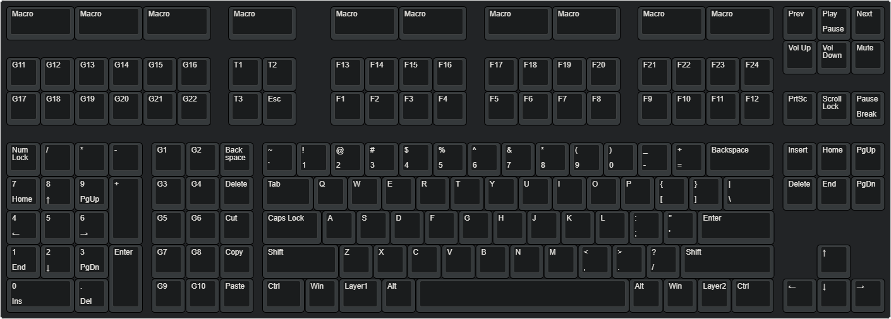

# Layout

For the design of the layout I had the intention of adding the F13-F24 keys ever sice I knew of their existence. 
Previously I had been using a logitech G710+ and was able to map those keys on the macrokeys.
Since they are standard keys, they can be used input keys for any program or game.

Additionally I wanted some shortcut keys on the left of the regular part, with functions such and copy and paste for quick access.
The numpad on the left is because whenever I want to use it, it is for filling in a lot of numbers.
This is significantly more convinient when the right hand can use the arrow keys or the mouse at the same time (i.e. excel or coding).

For coding especially, I had in mind to make some big macro buttons to be used as snippets.
In the default keymap there are some examples put on the first 3 macro keys.
Two of which would a insert block for and image or equation in LATEX.

To fill the void between the numpad and the macro keys, I added G11-G22, with no purpose in mind.
Perhaps some day I'll use it to for scripts, to start certain programs.
T1-T3 are intended by keyboard control, backlight levels, keymap profiles etc.

The [JSON](./keyboard-layout.json) can be viewed in the [layout editor](http://www.keyboard-layout-editor.com/#/).

In the default keymap G1-G3 are used as modofier triggers for the special characters used in the [EurKey](https://eurkey.steffen.bruentjen.eu/start.html) layout.
This adds a lot functionality when writing your everyday notes in math and physics.
Full layout options for version 1.2 of EurKey can be found [here](https://eurkey.steffen.bruentjen.eu/download/windows/1.2/eurkey-layout-complete.pdf)