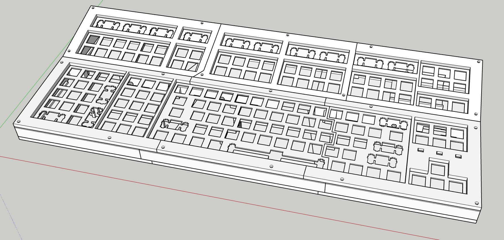
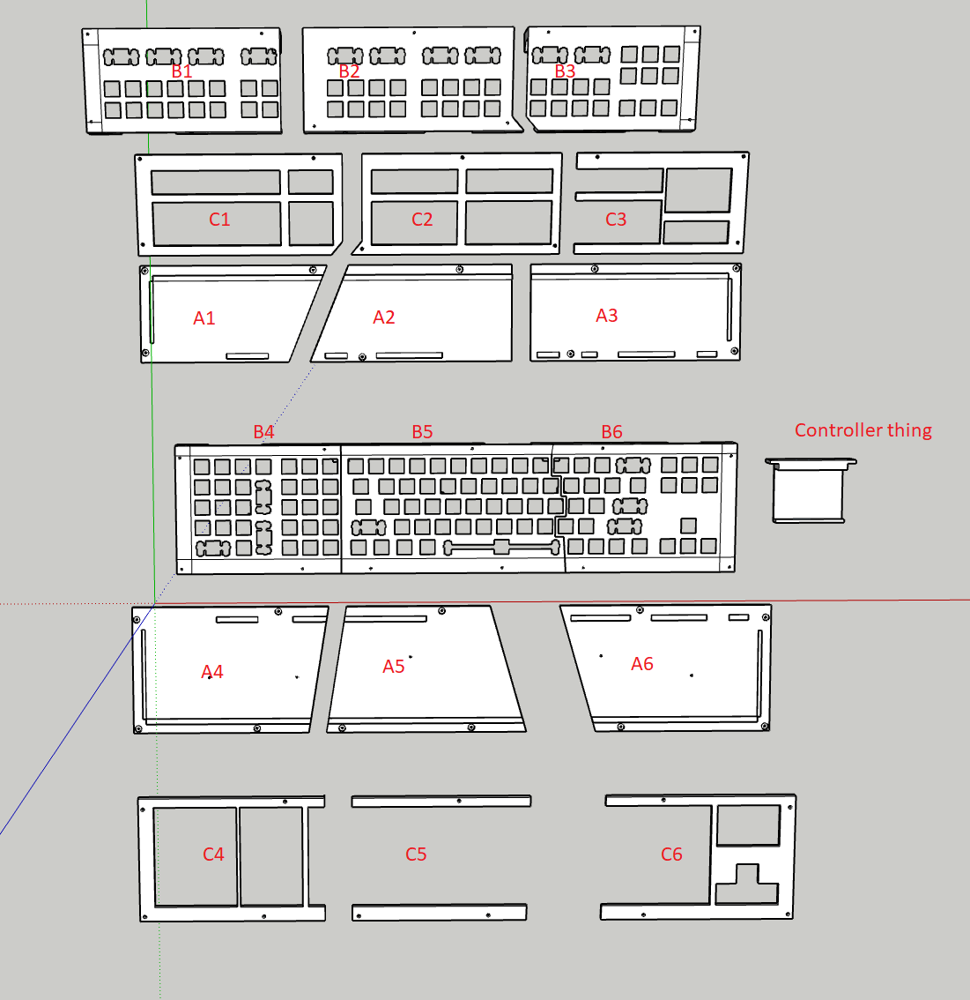

# STL files

All parts in this [list](./STL_parts) were printed in black PLA on a creality CR-20.
It includes the bracket I made for a teensy2.0++, but a bare version is also there to be adjusted to anything one desires.

Printing settings:
- 0.40mm nozzle
- 0.16mm layer height
- temperature 200C
- infill: hexatriangles 30%
- 

Additionally a very kind friend with a resin printer made some tiny translucent cubes.
These were sanded a bit and placed on top of the indicator LEDs (above the arrow keys).

## furter improvements
Many tiny things are not quite perfect.
Some of which are probably resolved with a better calibrated 3D printer that has linear acceleration correction enabled.
- The seam in the middle of the main part of the keyboard is very sub-optimal. 
 It works, but it is noticeable. 
 The distance between the O and the P is slightly larger than usual and the right part is slightly higher than the left.
 Although, when using the keyboard I have not noticed these issues physically, only visually.
- The connecting part where an M3 bolt and nuts connects the different sections is a bit too small. 
When applying force to screw it tight, two layers of the print slightly came loose.
It is still functional and I don't consider it broken, but it would be nicer if it was a bit stronger.
